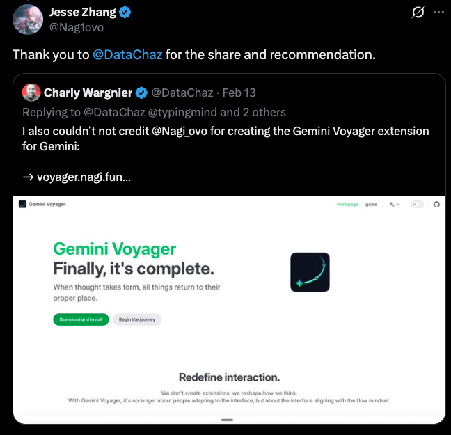
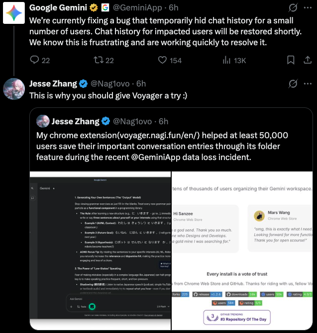

  
  <h1>Gemini Voyager</h1>
  <h3>Haz que tu experiencia con Gemini sea verdaderamente tuya ✨</h3>
  

    Navegación elegante por línea de tiempo, organización de chats con carpetas y tu propio depósito de prompts. 
    <b>Es la pieza que le faltaba a Google Gemini.</b>
  

  
  

    
    
    
    
    
    
  

  

    
    
    
    
    
    
    
    
    
  

  

    
    
  

  

    ✨ ¡Estamos en Product Hunt! Nos encantaría conocer tu opinión. ❤️
  

  <a href="https://voyager.nagi.fun/es">📖 Documentación</a> • 
  <a href="../README.md">English</a> • 
  <a href="./README_ZH.md">简体中文</a> •
  <a href="./README_ZH_TW.md">繁體中文</a> •
  <a href="./README_JA.md">日本語</a> •
  <a href="./README_FR.md">Français</a> •
  <a href="./README_PT.md">Português</a> •
  <a href="./README_RU.md">Русский</a> •
  <a href="./README_AR.md">العربية</a> •
  <a href="./README_KO.md">한국어</a>

    
  

  
   
  <b>🎉 ¡Altamente recomendado por los principales influencers tecnológicos!</b>

> [!NOTE]
> Si Gemini Voyager te resulta útil, compártelo en X, Reddit, YouTube, etc. Cada difusión ayuda a que más personas descubran el proyecto y mejoren la experiencia con Gemini. Gracias.

---

## 👋 ¿Por qué Gemini Voyager?

Nos encanta Gemini, pero a veces desearíamos que tuviera un poco más de estructura.

Por eso creamos **Gemini Voyager**. No es solo una herramienta; es un compañero que te ayuda a mantener tus conversaciones con IA organizadas, accesibles y productivas. Ya seas un investigador que maneja docenas de hilos, un desarrollador que guarda fragmentos de código, o simplemente alguien que ama el orden, Voyager está diseñado para ti.

  
   
  <i>Durante el problema del 18 de febrero en el que la aplicación Google Gemini hizo inaccesibles las conversaciones históricas de algunos usuarios, los usuarios de Voyager aún pudieron ver sus conversaciones guardadas en sus carpetas.</i>

---

## ✨ Funcionalidades

### 🌌 Núcleo Común (Gemini & AI Studio)

- **📂 [Organización por Carpetas](https://voyager.nagi.fun/es/guide/folders)**: Organiza tus chats en una jerarquía de dos niveles con soporte para **arrastrar y soltar** y **sincronización con Google Drive**.
  - **Gemini**: Soporta **Modo de Aislamiento de Cuenta** y **Colores de Carpeta Personalizados**.
- **💡 [Depósito de Prompts](https://voyager.nagi.fun/es/guide/prompts)**: Guarda y reutiliza tus mejores prompts en Gemini, AI Studio y [sitios web personalizados](https://voyager.nagi.fun/es/guide/custom-websites).
- **☁️ [Sincronización en la Nube](https://voyager.nagi.fun/es/guide/cloud-sync)**: Sincroniza tus carpetas y depósito de prompts con Google Drive.
- **📐 Copia de Fórmulas**: Copia en un clic los códigos fuente LaTeX y MathML (Word).

### ✨ Funciones Exclusivas de Gemini

- **📍 [Navegación de Línea de Tiempo](https://voyager.nagi.fun/es/guide/timeline)**: Nodos visuales para saltar entre mensajes, destacar momentos clave y gestionar ramas de conversación.
- **💾 [Exportación de Chat](https://voyager.nagi.fun/es/guide/export)**: Exporta conversaciones a JSON, Markdown o PDF con imágenes incluidas.
- **🧜‍♀️ [Renderizado Mermaid](https://voyager.nagi.fun/es/guide/mermaid)**: Renderizado automático de diagramas de flujo, diagramas de secuencia y otros gráficos Mermaid.
- **📝 [Corrección de Renderizado Markdown](https://voyager.nagi.fun/es/guide/markdown-fix)**: Corrige automáticamente la sintaxis de negrita de Markdown dañada por los elementos HTML inyectados por Gemini.
- **🍌 [NanoBanana](https://voyager.nagi.fun/es/guide/nanobanana)**: Eliminación de marca de agua sin pérdida para imágenes generadas por Gemini.
- **🔬 [Deep Research](https://voyager.nagi.fun/es/guide/deep-research)**: Extrae procesos de pensamiento y enlaces de investigación de las sesiones de Deep Research.
- **🛠️ Herramientas de Productividad**:
  - **[Eliminación por Lote](https://voyager.nagi.fun/es/guide/batch-delete)**: Limpia tu historial de forma masiva.
  - **[Respuesta con Cita](https://voyager.nagi.fun/es/guide/quote-reply)**: Responde con contexto seleccionando texto.
  - **[Sincronización de Título de Pestaña](https://voyager.nagi.fun/es/guide/tab-title)**: Sincroniza automáticamente el título de la pestaña del navegador.
  - **[Evitar desplazamiento automático](https://voyager.nagi.fun/es/guide/prevent-auto-scroll)**: Intercepta el comportamiento de salto no deseado al enviar un mensaje.
  - **[Colapso de Entrada](https://voyager.nagi.fun/es/guide/input-collapse)**: Área de entrada auto-colapsable para más espacio de lectura.
  - **[Modelo Predeterminado](https://voyager.nagi.fun/es/guide/default-model)**: Establece tu modelo preferido por defecto.
  - **[Ocultar elementos recientes y Gems](https://voyager.nagi.fun/es/guide/recents-hider)**: Oculta la lista "Recientes" en la barra lateral para reducir las distracciones.

---

## 📥 Instalación

> ⚠️ Nota: El Administrador de Prompts es la única función que admite Gemini para Empresas.

  
  &nbsp;&nbsp;
  
  &nbsp;&nbsp;
  
  &nbsp;&nbsp;
  

  <b>Chrome Web Store</b> también funciona en Edge, Opera, Brave, Vivaldi, Arc y otros navegadores Chromium.

> **Estado de la Tienda:** Chrome ✅ · Firefox ✅ · Edge ✅ · Safari ✅

Para **instalación manual** o **compilaciones de desarrollo**, consulta la [Guía de Instalación](https://voyager.nagi.fun/es/guide/installation).

---

## ☕ Apoya este Proyecto

  

Si Gemini Voyager te facilita la vida, considera invitarme a un café. ¡Ayuda a mantener las actualizaciones! Los patrocinadores aparecerán en nuestra sección de Agradecimientos Especiales. ❤️

  
  
  
  
<b>O apoya a través de WeChat / Alipay / Afdian:</b>

  <table align="center" border="0" cellpadding="0" cellspacing="0">
    <tr>
      <td align="center">
         
        <b>WeChat Pay</b>
      </td>
      <td align="center">
         
        <b>Alipay</b>
      </td>
      <td align="center">
        <a href="https://afdian.com/a/nagi-ovo" target="_blank">
          <picture>
            <source media="(prefers-color-scheme: dark)" srcset="https://afdian-connect.deno.dev/profile.svg?slug=nagi-ovo&bg_color=%230d1117&text_color=%23dedbd7&border_color=%232e343d" />
            <source media="(prefers-color-scheme: light)" srcset="https://afdian-connect.deno.dev/profile.svg?slug=nagi-ovo" />
            
          </picture>
        </a> 
        <b>Afdian</b>
      </td>
    </tr>
  </table>

### 🎙️ Herramienta recomendada: Typeless

Recomiendo encarecidamente **[Typeless (typeless.com)](https://www.typeless.com/refer?code=MZRYZP1)**, una herramienta de voz a texto con IA que utilicé extensamente durante el desarrollo de Gemini Voyager. Integrarlo en mi flujo de trabajo diario me ha ahorrado muchísimo tiempo.

> 🎁 **[Únete a través de mi enlace de referido](https://www.typeless.com/refer?code=MZRYZP1)** (Código: **`MZRYZP1`**) para obtener **$5 de crédito gratis**. ❤️

---

## 🤝 Contribución y Desarrollo

¡Damos la bienvenida a las contribuciones!

- **Issues**: Usa nuestras plantillas de [informe de errores](https://github.com/Nagi-ovo/gemini-voyager/blob/main/.github/ISSUE_TEMPLATE/bug_report.md) o [solicitud de funcionalidades](https://github.com/Nagi-ovo/gemini-voyager/blob/main/.github/ISSUE_TEMPLATE/feature_request.yml).
- **Pull Requests**: Revisa [CONTRIBUTING.md](./CONTRIBUTING.md).

¡Gracias por ayudar a que Gemini Voyager sea mejor! ❤️

---

## 🌟 Créditos

- **[DeepSeek Voyager](https://github.com/Azurboy/deepseek-voyager)** - Un fork de Gemini Voyager adaptado para DeepSeek.

- **[ChatGPT Conversation Timeline](https://github.com/Reborn14/chatgpt-conversation-timeline)** - La fuente original de inspiración para la navegación por línea de tiempo.

---

  <a href="https://www.star-history.com/#Nagi-ovo/gemini-voyager&type=date&legend=top-left">
   <picture>
     <source media="(prefers-color-scheme: dark)" srcset="https://api.star-history.com/svg?repos=Nagi-ovo/gemini-voyager&type=date&theme=dark&legend=top-left" />
     <source media="(prefers-color-scheme: light)" srcset="https://api.star-history.com/svg?repos=Nagi-ovo/gemini-voyager&type=date&legend=top-left" />
     
   </picture>
  </a>
  
Hecho con ❤️ por Jesse Zhang

  GPLv3 License © 2026

